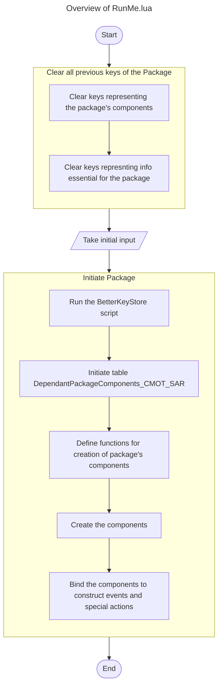

# Downed Unit Creates Survivors
## Table of Content
| Content                                                   |
| ---                                                       |
| 🎯[Purpose](#content-purpose)                             |
| ✨[Features](#content-features)                           |
| ✔[Requirements](#content-requirements)                   |
| 📝[Instruction](#content-instructions)                    |
| 🔮[Future Enhancements](#content-futureenhancements)      |
| 🔒[Reserved Variables](#content-reservedvariables)        |
| 📖[Terminology](#content-terminology)                     |
| 🔀[Flowchart](#content-flowchart)                         |
| 🗒️[Development Notes](#content-developmentnotes)          |
| 🔗[Links](#content-links)                                 |


## <p id='content-purpose'>Purpose🎯</p>
&emsp;This package adds SAR aspect to scenarios for downed *aircrafts*

The survivors are rescued if they are brought back to base


## <p id='content-features'>Features✨</p>
- Upon aircraft death
    - It has a probability of producing an `aircraft wrackage`
    - it has a probability of producing a survivor based on:
        - Unit proficiency
        - Whether the unit was destroyed or out-of-fuel
        - An arbitrary base proficiency, set within the script
- Downed pilot deploys a `smoke marker` to indicate survivors
    - The marker will disappear after a period of time starting from when its survivor is picked up
- Survivors are counted as rescued only when their rescuer (an aircraft unit) has landed on an airfield/helipad
- Downed aircraft due to `Out-of-fuel` status has a slight chance of not producing any survivors
- Aerial Drones won't create any survivors
- The package retains functionality even when the game is loaded again


## <p id='content-requirements'>Requirements✔</p>
- ### 2 Sides
    - One for the Player
    - One for the SAR units
- ### CMO Version
    - CMO version must be atleast version `____`


## <p id='content-instructions'>Instructions📝</p>
### Adding the Package
- Open the desired scenario as a scenario editor
- Open the Lua Console
- Into the Lua Console, copy and paste the content of the lua script [*RunMe.lua*][directorylink-runme]
- Run the Script within the console
- Select "**Add Package**"
- Follow the instructions that will pop-up
- Create your own SAR team(s)/unit(s)
    - A helicopter is recommended
    - The SAR unit must be able to load in the survivor as a cargo unit
- Provide proper equipment for the SAR team(s)/unit(s):
    - Equipment: An `Infrared` sensor to the SAR team/unit
    - Reason: A Survivor has only a *0.1* nm infrared detection range
    - Example Sensors:

        | Sensor                                            | Max Range | DBID  |
        | ---                                               | ---       | ---   |
        | Generic Infrared Reconnaissance Camera (1st Gen)  | 5nm       | 5228  |
        | Generic IR Camera                                 | 15nm      | 5770  |

- Provide instruction to the players on how to rescue survivors
- Done

### Performing SAR
- Scan the area where the aircraft was downed for any wreckage/smoke-marker
- If a smoke marker is found, send a SAR asset to the marker
- When the survivor is detected, **pick him up as cargo** into your SAR asset
- Return the loaded SAR asset back to a base by the action of **landing** on the base

### Deleting the Package
- Open the desired scenario as a scenario editor
- Open the Lua Console
- Into the Lua Console, copy and paste the content of the lua script [*RunMe.lua*][directorylink-runme]
- Run the Script within the console
- Select "**Delete Package**"
- Delete any remaining CMOT events, trigger, conditions and actions
    - Automatic deletion for these components will be implemented in future iterations
- Clear the following keys using the functions:
    ```lua
    ScenEdit_ClearKeyValue("EventGuid_CMOT_ScenarioLoaded")
    ScenEdit_ClearKeyValue("ActionGuid_CMOT_BetterKeyStore")
    ScenEdit_ClearKeyValue("TriggerGuid_CMOT_ScenarioLoaded")
    ```
- Done


## <p id='content-futureenhancements'>Future Enhancements🔮</p>
- ### Number of survivors depend upon the number of crew members in the aircraft
- ### Implementing wreckage limit that the player can set themselve
    - Make it dynamic, where the player can change the value mid-game
- ### Abandoned downed pilots becomes a POW
    - Abandoned Survivors that are within an enemy territory for a set amount of time will become a POW
    - Implementation:
        - Use "UnitRemainInArea"
        - Enemy Units converges onto the downed plane/survivor after a set amount of time
        - The said Enemy Units will be a group set by the scenario creator
- ### Ability to jump the camera to where the survivor was found
- ### Ability to disable specific notifications
- ### Ability to permanently drop selected wreckages
- ### Clean Removal of the package


## <p id='content-reservedvariables'>Reserved Variables🔒</p>
The follow variables, keys and functions are reserved and should not be overwriten, unless specified, for the proper functioning of the package

- ### Keys
    - #### PackageComponents_CMOT_SAR
        - Stores a table of guids of the normal components of the package
        - Format:
            - {Events={}, Triggers={}, Conditions={}, Actions={}, SpecialActions={}}

    - #### CMOT_SAR_Aircraft_SurvivorList
        - Stores a table of guids of the survivors and smoke marker
        - Format:
            - {{survivor = survivor.guid, marker = marker.guid}}

    - #### CMOT_SAR_AircraftWreckageList
        - Stores a table of guids of the wreckages

    - #### CMOT_SAR_PlayerSide
        - Stores the guid of the player side

    - #### CMOT_SAR_SARSide
        - Stores the guid of the SAR side

    - #### CMOT_SAR_AircraftWreckageLimit
        - Stores the limit of wreckages allowed at a time

    - #### DependantPackageComponents_CMOT_SAR
        - Stores a table of dependant package components
        - Format:
            - {{`guidDependentComponent`, `componentTypeDependentComponent`, `keystorekey`, `guidCommonComponent`}}
    
    - #### EventGuid_CMOT_ScenarioLoaded
        - Stores the guid of the common component of type `event` for `ScenLoaded`
    
    - #### TriggerGuid_CMOT_ScenarioLoaded
        - Stores the guid of the common component of type `trigger` for `Scenario Loaded`
    
    - #### ActionGuid_CMOT_BetterKeyStore
        - Stores the guid of the common component of type `action` for the lua script `BetterKeyStore`
    
    - #### ActionGuid_CMOT_SAR_Aircraft_GetKeys
        - Stores the guid of the common component of type `action` for the lua script `SAR_Aircraft_GetKeys`


## <p id='content-terminology'>Terminology📖</p>
- #### Common Component
    - A component, **usually an event** with a very common trigger (like `ScenLoaded`), that may have multiple components from different packages utilizing it, which reduces the creation of the same triggers
- #### Component
    - It may be any of the following:
        - Event
        - Trigger
        - Condition
        - Action
        - Special Action
- #### Dependant Component
    - A component, **usually a trigger**, that utilizes or is dependant on a common component
- #### Package
    - A feature pack to add to the game/simulation
- #### SAR
    - Abbreviation for **Search And Rescue**


## <p id='content-flowchart'>Flowchart🔀</p>
- ### Overview of RunMe.lua



## <p id='content-developmentnotes'>Development Notes🗒️<p>
- Reserch the effects of unit property `SAR_enable` for Survivors
- For Performance improvement:
    - Implement Binary Search Algorithm
- When the content of the variable `LuaScript_CMOTBetterKeyStore` is updated, then also update the content of the function `Run_BetterKeyStore()`
- Packages should only refer to the variables that stores the corresponding keystore values

- ### To Do:
    - #### Refer to sides using their guids, instead of their name/description
        - Set changes to `CMOT_SAR_SARSide`
        - Set changes to `CMOT_SAR_PlayerSide`
    - #### Handling common components across multiple packages
        - Deletion of a common component should be made when the shared trigger no longer has any dependent components
        - {nameCommonComponent = {guidCommonComponents, typeComponentCommonComponent, countDependentPakages}}
    - #### Proper naming of the components
        - Renaming components to distinguish CMOT components from other components
    - #### Clean Removal of the package
        - Ability and choice for the scenario editor to also remove any existing CMOT_SAR units (Wreckage, markers or survivors)
        - Shared components still used by other Packages shouldn't be removed, if any

- Local functions and their purpose:
    - CMOT_SAR_InitialInput()
        - Initiates the input phase of the SAR Package

    - ClearAllPackageKeyStore()
    - ClearPackage_CMOT_SAR()
        - Clears all keys related to the package

    - Clear_PackageComponents_CMOT_SAR()
        - Clears all keys of the components of package

    - CMOT_SAR_Aircraft_Init()
        - Initiates the initialization of the package
    
    - Run_BetterKeyStore()
        - Runs the `BetterKeyStore` lua script that allows conversion of tables to strings and vice-versa
        - It allows the storage of tables in the keystore

    - AddTo_PackageComponents_CMOT_SAR(table componentType, string guid)
        - Adds the guid of the non-dependant components to the table PackageComponents_CMOT_SAR
        - The table `componentType` is passed as `PackageComponents_CMOT_SAR.type`

    - AddTo_DependantPackageComponents_CMOT_SAR(string guidDependantComponent, string componentTypeDependentComponent, string guidCommonComponent)
        - Adds information of the dependant component to the table `DependantPackageComponents_CMOT_SAR`
        - This will help in safely unbinding dependent components from the common components

    - Event_CMOT_ScenarioLoaded()
        - Creates a common component of type `event` for `ScenLoaded`
    
    - Trigger_CMOT_ScenarioLoaded()
        - Create a common component of type `trigger` for `ScenLoaded`
    
    - Action_LuaScript_CMOTBetterKeyStore()
        - Create a common component of type `action` for the lua script `BetterKeyStore`
    
    - Action_LuaScript_CMOT_SAR_Aircraft_GetKeys()
        - Create a common component of type `action` for the lua script `LuaScript_CMOT_SAR_Aircraft_GetKeys`
        - The script is initialized at ScenLoaded
        - It imports keys related to the package
    


## <p id='content-links'>Links🔗</p>
[GitHub][weblink-github-account-mebanseibor]
[Repository][weblink-github-repo-cmo]


<!-- weblink -->
[weblink-github-account-mebanseibor]: https://github.com/Mebanseibor
[weblink-github-repo-cmo]: https://github.com/Mebanseibor/Command-Modern-Operations/

<!-- directorylink -->
[directorylink-runme]: ./RunMe.lua