# Visualize a unit's or contact's Future Predicted Path by Time

## Purpose:
&emsp;Create a plot of a unit or contact's predicted trajectory by specifying a future time point

## Preview
### Before
### After
### Menu/Input

## Future Features:
- #### Ability to plot path for both selected units and contacts
- #### RPs display the following information
    - Unit/Contact Name
    - Zulu Time of arrival
- #### Option to bulk delete all points of the predicted path of a unit/contact by:
    - Selecting a RP
    - Selecting a Unit/Contact
- #### Option to delete paths for non-existant units
- #### Store the path table as a keystore

## Flowchart:
### How to Use

```mermaid
flowchart
    Start([Start])
    SelectUnitOrContact["Select unit(s)/contact(s)"]
    InputMode[/"Input mode: (Add/Delete) path"/]
    ChoiceAddOrDeletePath{Mode chosen}
    InputAddPath[/Input desired parameters/]
    InputDeletePath[/Select Path/]
    AddPath[Add Path]
    DeletePath[Delete Path]
    End([End])



    Start --> SelectUnitOrContact --> InputMode --> ChoiceAddOrDeletePath

    %% ChoiceAddOrDeletePath
        ChoiceAddOrDeletePath --> |Add➕| InputAddPath --> AddPath --> End
        ChoiceAddOrDeletePath --> |Delete❌| InputDeletePath --> DeletePath --> End
```

### Adding a path prediction
